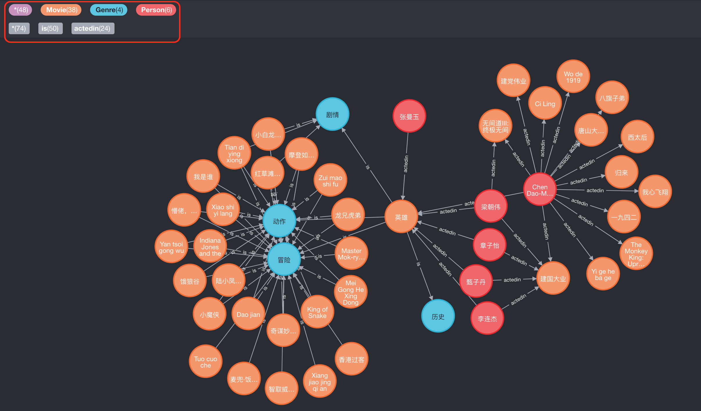

## 最终效果

项目代码参考: [chatbot](https://github.com/Mrzhang3389/chatbot)

## 知识图谱篇

#### 为什么需要使用知识图谱

对原始数据流建立更加规范的数据表达，通过语义抽取、数据链接形成更多机器可理解的语义知识，从而将原本异构分散的各种数据转变为机器可计算的大数据。

将离散异构的数据通过图的方式链接成结构化的数据, 组成垂直领域的知识库,  用以对最后问题的答案查找.

#### 准备工作

- 电影知识库的数据参考: [movie data](https://github.com/Mrzhang3389/chatbot/tree/master/KnowledgeGraph/movie_data)
- Neo4j图数据库
  - Neo4j官网: [Neo4j home](https://neo4j.com/)
  - Neo4j桌面版: [Neo4j Desktop](https://neo4j.com/download-center/#desktop)
  - Neo4j服务器版: [Neo4j Server](https://neo4j.com/download-center/#community)
  - Neo4j Docker版:  `docker pull neo4j`
- 简单的Neo4j语法知识: [Neo4j Cypher](https://neo4j.com/docs/cypher-refcard/current/)

#### 操作步骤

1. 运行你的Neo4j图数据库
2. 导入电影知识库数据: [数据导入](https://github.com/Mrzhang3389/chatbot/tree/master/KnowledgeGraph#%E4%BA%8C-%E5%AF%BC%E5%85%A5%E6%95%B0%E6%8D%AE)
3. 测试数据是否导入正常: [测试知识图谱](https://github.com/Mrzhang3389/chatbot/tree/master/KnowledgeGraph#%E4%B8%89-%E4%BD%BF%E7%94%A8%E6%95%B0%E6%8D%AE)
4. 答案查找的Python代码参考: [答案搜索](https://github.com/Mrzhang3389/chatbot/blob/master/KnowledgeGraph/get_answer.py)

#### 知识图谱所达到的效果

## 机器学习篇

#### 为什么需要机器学习

通过机器学习对用户提出的问题, 进行问题模板分类, 关键时间 人名 地点 等词的抽取, 然后组成用户提问的真正意图, 最后在知识库中查找用户想得到的答案.

#### 准备工作

- 高斯朴素贝叶斯原理根据自身情况学习: [参考维基百科](https://zh.wikipedia.org/wiki/%E6%9C%B4%E7%B4%A0%E8%B4%9D%E5%8F%B6%E6%96%AF%E5%88%86%E7%B1%BB%E5%99%A8#%E9%AB%98%E6%96%AF%E5%96%AE%E7%B4%94%E8%B2%9D%E6%B0%8F)
- Python下scikit-learn包里面的naive_bayes的使用
- 准备模型的训练数据: [数据参考](https://github.com/Mrzhang3389/chatbot/tree/master/MachineLearning/train_model/data)

#### 操作步骤

1. 对允许用户提问的问题进行分类
2. 创造用户提问的问题模板, 即准备工作中的准备模型的训练数据
3. 训练问题分类模型: [代码参考](https://github.com/Mrzhang3389/chatbot/blob/master/MachineLearning/train.py)
4. 使用问题分类模型得到用户的意图: [代码参考](https://github.com/Mrzhang3389/chatbot/blob/master/MachineLearning/analyze_question.py)

#### 机器学习所达到的效果:

## 机器学习训练模型详细篇: [模型训练文档](https://github.com/Mrzhang3389/chatbot/tree/master/MachineLearning#%E6%9C%BA%E5%99%A8%E5%AD%A6%E4%B9%A0%E7%AF%87)
